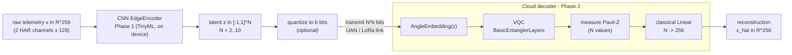

# Hybrid Quantum-Classical Asymmetric Autoencoder (AIoT 2026)

Extreme compression of IoT telemetry for constrained links (UAN / LoRa): a tiny
**classical edge encoder** ships a few latent values; an expressive **quantum cloud
decoder** reconstructs the full signal. Trained end-to-end; only the encoder is deployed.

```
DEVICE (dummy):  x in R^D --[Phase1: classical edge encoder, TinyML]--> z in [-1,1]^N  (N << D)
                 --> transmit z   (no quantum-specific scaling on the device)
CLOUD:           z --[qml.AngleEmbedding(z): embeds encoder output directly]--> [VQC on N qubits]
                 --> <Z_i> (N values) --[classical Linear N->D]--> x_hat in R^D
```

The classical expansion `Linear(N -> D)` means **only N (= bottleneck) qubits are
simulated**, so large D (here 256) is fully simulatable.

## Workflow



End-to-end training (MSE) couples encoder + decoder (Phase 3); deployment exports **only the
encoder** to ONNX (Phase 4). Two classical decoders (`matched`, `pure`) are trained the same
way as fair baselines, and the latent can be quantized to `b` bits to study rate-distortion.

## Files

| File | Role |
|------|------|
| `run_experiment.py` | Main multi-seed sweep: CNN encoder + quantum/matched/pure decoders across N. Defines the models reused by the other scripts. |
| `train_and_deploy.py` | Train one model, then **split** it for deployment: saves `trained_encoder/decoder_N*.pt` + `edge_encoder_N*.onnx`. |
| `compare_decoders.py` | Focused, multi-seed quantum-vs-classical decoder comparison at one N. |
| `quantize_eval.py` | Latent **quantization & rate-distortion** study (MSE + SNR vs bits). |
| `plot_results.py` | Clear results figure (parses `run_sweep.log`). |
| `plot_sweep.py` | Post-sweep convergence/reconstruction plots for the CNN encoder. |
| `data.py` | Loads real UCI HAR (`load_dataset("har")`); synthetic fallback. |
| `datasets/` | UCI HAR inertial signals + `.npz` cache. |
| `edge_encoder_N*.onnx`, `trained_*_N*.pt` | Deployment artifacts: edge encoder (ONNX) + saved model halves. |
| `results_*.png` | Figures (main sweep, quantization, reconstructions). |

Environment: a Python venv with `torch`, `pennylane`, `pennylane-lightning`,
`onnx`, `onnxscript`, `scikit-learn`.

## Setup (the venv and dataset are not in git)

```bash
# 1) environment
python3 -m venv .venv
./.venv/bin/pip install torch --index-url https://download.pytorch.org/whl/cpu
./.venv/bin/pip install pennylane pennylane-lightning onnx onnxscript scikit-learn matplotlib

# 2) UCI HAR dataset -> ./datasets/
mkdir -p datasets && cd datasets
curl -sSL -o har.zip "https://archive.ics.uci.edu/static/public/240/human+activity+recognition+using+smartphones.zip"
unzip -q har.zip && unzip -q "UCI HAR Dataset.zip"   # yields ./datasets/UCI HAR Dataset/
cd ..
```

First run caches the dataset to `datasets/har_cache.npz`.

## Run everything

All commands from inside `qic/`, using the venv interpreter. Long runs should go in the
`simulations` tmux session, e.g. `tmux send-keys -t simulations '<cmd> > out.log 2>&1' Enter`.

```bash
cd /home/fabio/Quantum/OurFramework/qic

# 1. Main sweep: hybrid vs classical decoders across compression ratios (multi-seed)
../.venv/bin/python run_experiment.py        # -> run_sweep.log, edge_encoder_N*.onnx
../.venv/bin/python plot_results.py          # -> results_hybrid.png (clear figure)

# 2. Latent quantization & rate-distortion (transmitted bits vs reconstruction error)
../.venv/bin/python quantize_eval.py         # -> results_quantization.png, results_quantization_N8.png

# 3. Focused quantum-vs-classical comparison at one bottleneck
../.venv/bin/python compare_decoders.py --N 8 --seeds 0 1 2

# 4. Train then split for deployment (saves encoder/decoder .pt + encoder ONNX)
../.venv/bin/python train_and_deploy.py --N 6 --epochs 80

# 5. Post-sweep plots for the CNN encoder
../.venv/bin/python plot_sweep.py
```

Tunable knobs live at the top of each script (`D`, `N_VALUES`, `BITS`, `SEEDS`, `EPOCHS`, ...).

## Result (real HAR, D=256, 5 seeds: mean ± std)

> Note: this table is from the earlier **MLP** encoder. The current code uses a **1D-CNN**
> encoder (and a quantization study); results are being regenerated — see `run_sweep.log`
> and `results_quantization.png`.

| N | compression | MSE hybrid | MSE matched-classical | MSE pure-classical | encoder |
|--:|--:|--:|--:|--:|--:|
| 2 | 128× | 0.0365 ± .0042 | 0.0338 ± .0023 | 0.0352 ± .0020 | 7.0 KB |
| 4 | 64×  | 0.0285 ± .0004 | 0.0288 ± .0003 | 0.0291 ± .0001 | 6.9 KB |
| 8 | 32×  | 0.0253 ± .0009 | 0.0267 ± .0013 | 0.0280 ± .0005 | 6.9 KB |

**Honest reading** (matched-classical is the fair test — same encoder + expansion, only the
middle N->N block differs):

- 128×: hybrid slightly *worse* than matched (error bars overlap) — a wash.
- 64×:  statistically **tied**.
- 32×:  hybrid shows a **small edge** (0.0253 vs 0.0267), but the ~1σ bands still overlap.
- The hybrid consistently beats *pure*-classical (no middle layer) — expected, weak baseline.

**Supported claims:** comparable fidelity at 32-128× with a **~7 KB TinyML edge encoder**;
simulatable at large D; a *suggestive (not conclusive)* small benefit at moderate (32×)
compression. **Not yet supported:** a robust "outperforms classical AEs" — the edge is within
~1σ and inconsistent across N; more seeds / a second dataset would be needed to claim it.

## Caveats / next steps

- Single seed; MSE gaps (~0.0005) are likely within noise -> add a seed loop for mean+/-std
  to firmly establish parity (each run is ~15 s).
- "PAoI reduction" = payload/compression ratio only (ignores propagation); not a true PAoI.
- Older directions (quantum-inspired transform coding, symmetric QAE) are archived in
  `/home/fabio/Quantum/_ourframework_old_workflows.tgz`.
