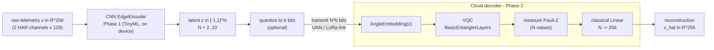

# Hybrid Quantum-Classical Asymmetric Autoencoder (AIoT 2026)

Extreme compression of IoT telemetry for constrained links (UAN / LoRa): a tiny
**classical edge encoder** ships a few latent values; an expressive **quantum cloud
decoder** reconstructs the full signal. Trained end-to-end; only the encoder is deployed.

```
DEVICE (dummy):  x in R^D --[Phase1: classical edge encoder, TinyML]--> z in [-1,1]^N  (N << D)
                 --> transmit z   (no quantum-specific scaling on the device)
CLOUD:           z --[qml.AngleEmbedding(pi*z): cloud scales [-1,1] -> [-pi,pi]]--> [VQC on N qubits]
                 --> <Z_i> (N values) --[classical Linear N->D]--> x_hat in R^D
```

The classical expansion `Linear(N -> D)` means **only N (= bottleneck) qubits are
simulated**, so large D (here 256) is fully simulatable.

## Workflow



End-to-end training (MSE) couples encoder + decoder (Phase 3); deployment exports **only the
encoder** to ONNX (Phase 4). Two classical decoders (`matched`, `pure`) are trained the same
way as fair baselines, and the latent can be quantized to `b` bits to study rate-distortion.

## How it works

The system is an **asymmetric** autoencoder: the compressor that runs on the device is
classical and tiny; the decompressor that runs in the cloud is an expressive quantum circuit.

1. **Sense & encode (device, Phase 1).** A window of multi-channel inertial telemetry
   (2 HAR channels × 128 = 256 values) is compressed by a small 1D-CNN encoder (~5 KB) to a
   latent `z in [-1,1]^N` (N = 2..10). Only this encoder is deployed on the device.
2. **Quantize & transmit.** `z` is optionally quantized to `b` bits, so the packet is
   `N × b` bits — small enough for a bandwidth-starved acoustic / LoRa link.
3. **Decode (cloud, Phase 2).** A variational quantum circuit angle-embeds `z` onto N qubits,
   entangles them, measures N expectation values, and a classical `Linear(N→256)` expands
   them back to the full signal. Only N qubits are simulated, so it scales with the data dim.
4. **Train then split (Phases 3–4).** Encoder + decoder are trained jointly on reconstruction
   MSE (gradients flow through the quantum circuit into the encoder); the encoder is then
   exported to ONNX for the device, while the quantum decoder stays in the cloud.

Research question: does the quantum decoder let the device compress more aggressively (smaller
N or fewer bits) at equal fidelity than a classical decoder? Every hybrid run is compared
against `matched`/`pure` classical baselines, and the quantization study maps the
bits-vs-reconstruction-error trade-off.

## Files

| File | Role |
|------|------|
| `run.sh` | **One entry point** — edit the switches at the top, then `bash run.sh`. |
| `run_experiment.py` | Main multi-seed sweep: CNN/GRU/FFT encoder + quantum/matched/pure decoders across N. Trains end-to-end, exports the edge encoder to ONNX, saves `results_hybrid.png`. Defines the models (incl. the bounded-gain control) reused by `quantize_eval.py`. |
| `quantize_eval.py` | Evaluation studies with 3 modes: `quant` (rate-distortion), `noise` (channel robustness), `parameff` (parameter-efficiency). `--control` adds the bounded-gain classical decoder. |
| `_floor_probe.py` | Diagnostic: PCA reconstruction floor vs linear vs MLP decoder head per N (shows how much MSE is achievable). |
| `data.py` | Loads real UCI HAR (`load_dataset("har")`); synthetic fallback. |
| `datasets/` | UCI HAR data — **not in git**, downloaded per the Setup section below (cached to `har_cache.npz` on first run). |
| `edge_encoder_N*.onnx` | Deployment artifact: the TinyML edge encoder exported to ONNX (produced by `run_experiment.py`). |
| `results_*.png` | Result figures: `results_hybrid.png` (sweep), `results_quantization.png`, `results_noise.png`. |

**Model knobs (env vars / flags):** `QIC_ENCODER` or `--encoder` (`cnn`/`gru`/`fft`); `QIC_HEAD`
(`linear` default, or `mlp` for a nonlinear cloud decoder head); `--control` (add the bounded-gain
classical decoder to the eval). The angle embedding is π-scaled cloud-side and the input is
min-max normalized **per channel** (preserves waveform shape).

Environment: a Python venv with `torch`, `pennylane`, `pennylane-lightning`,
`onnx`, `onnxscript`, `scikit-learn`.

## Setup (the venv and dataset are not in git)

```bash
# 1) environment
python3 -m venv .venv
./.venv/bin/pip install torch --index-url https://download.pytorch.org/whl/cpu
./.venv/bin/pip install pennylane pennylane-lightning onnx onnxscript scikit-learn matplotlib

# 2) UCI HAR dataset -> ./datasets/
mkdir -p datasets && cd datasets
curl -sSL -o har.zip "https://archive.ics.uci.edu/static/public/240/human+activity+recognition+using+smartphones.zip"
unzip -q har.zip && unzip -q "UCI HAR Dataset.zip"   # yields ./datasets/UCI HAR Dataset/
cd ..
```

First run caches the dataset to `datasets/har_cache.npz`.

## Run everything

**Easiest:** edit the switches at the top of `run.sh` (`ENCODER`, `SMOKE`, `RUN_*`) and launch
it — ideally inside the `simulations` tmux session for long runs:

```bash
cd /home/fabio/Quantum/OurFramework/qic
bash run.sh
```

**Or run pieces by hand** (from `qic/`, with the venv interpreter; `--encoder cnn|gru`, `--quick`):

```bash
# main sweep: hybrid vs classical decoders across compression ratios (multi-seed)
../.venv/bin/python run_experiment.py --encoder cnn        # -> results_hybrid.png, edge_encoder_N*.onnx

# evaluation studies (one mode at a time)
../.venv/bin/python quantize_eval.py quant --encoder cnn            # rate-distortion -> results_quantization.png
../.venv/bin/python quantize_eval.py quant --encoder cnn --control  # + bounded-gain control decoder
../.venv/bin/python quantize_eval.py noise --encoder cnn            # channel noise   -> results_noise.png
../.venv/bin/python quantize_eval.py parameff                       # param efficiency
```

Multi-seed paper runs add `--seeds 0 1 2 3 4 --epochs 80`. Set `QIC_HEAD=mlp` to swap the linear
cloud decoder for a nonlinear MLP head (lowers reconstruction MSE; see `_floor_probe.py`).

Add `--quick` to any run for a fast smoke test. Tunable knobs are at the top of each script.

Default is `cnn`. The GRU hidden size is `RNN_HIDDEN` (32 ≈ 14.5 KB; set 64 for ≈ 53 KB) — both
under the ~66 KB edge budget. Note: the encoder choice does **not** fix peak smoothing (that's the
N-value bottleneck); it changes how temporal features are extracted.

## Result (real HAR, D=256, 1D-CNN encoder, 5 seeds, 80 epochs)

The authoritative numbers are printed by the scripts and plotted to `results_*.png`. Summary of
where things stand:

**1. Full-precision reconstruction is a tie.** Across N, hybrid ≈ matched ≈ pure; with proper
training the classical decoders are if anything *slightly better*. The quantum decoder does **not**
improve reconstruction MSE — the bottleneck is N (the linear-head AE already sits at the PCA floor;
a nonlinear `QIC_HEAD=mlp` head recovers ~15%, but for *all* decoders).

**2. The real effect is graceful degradation under aggressive quantization.** Reconstruction MSE
vs bits-per-latent (`quant`, N×b-bit payload):

| N | 8 bit | 2 bit | 1 bit (hybrid) | 1 bit (matched) | 1-bit gap |
|--:|--:|--:|--:|--:|--:|
| 8 | h 0.0094 / m 0.0090 | h 0.0266 / m 0.0242 | **0.0336** | 0.1379 | **4.1×** |
| 10 | h 0.0095 / m 0.0085 | h 0.0236 / m 0.0288 | **0.0261** | 0.1700 | **6.5×** |

At ≥3 bits the classical decoder is **better or tied**. At **1 bit** the classical decoder
*collapses* while the hybrid degrades gracefully, and the gap **grows with N**. So the defensible
claim is narrow but real: *the quantum decoder is a fail-safe at extreme (1-bit) compression*, not
a general efficiency win.

**Honest caveats (must address before claiming a quantum advantage):**

- **Post-training quantization only** — quantization-aware training (QAT) may let the classical
  decoder close the 1-bit gap; untested.
- **Bounded-gain vs quantum** — the classical decoder may collapse at 1 bit simply because its
  unbounded weights amplify quantization noise. The `--control` bounded-gain classical decoder
  tests whether the robustness is genuinely *quantum* or reproducible by any bounded map.
- **System-level, not decoder-level** — each system's encoder is trained jointly with its own
  decoder, so the comparison isn't a clean decoder isolation (a frozen-encoder swap would be).

## Caveats / next steps

- Re-run `results_hybrid.png` with `--nseeds 5` (currently a smoke); finish the `noise` run; run
  the `--control` rate-distortion to settle the quantum-vs-bounded-gain question.
- "PAoI reduction" = payload/compression ratio only (ignores propagation); not a true PAoI.
- Older directions (quantum-inspired transform coding, symmetric QAE) are archived in
  `/home/fabio/Quantum/_ourframework_old_workflows.tgz`.
